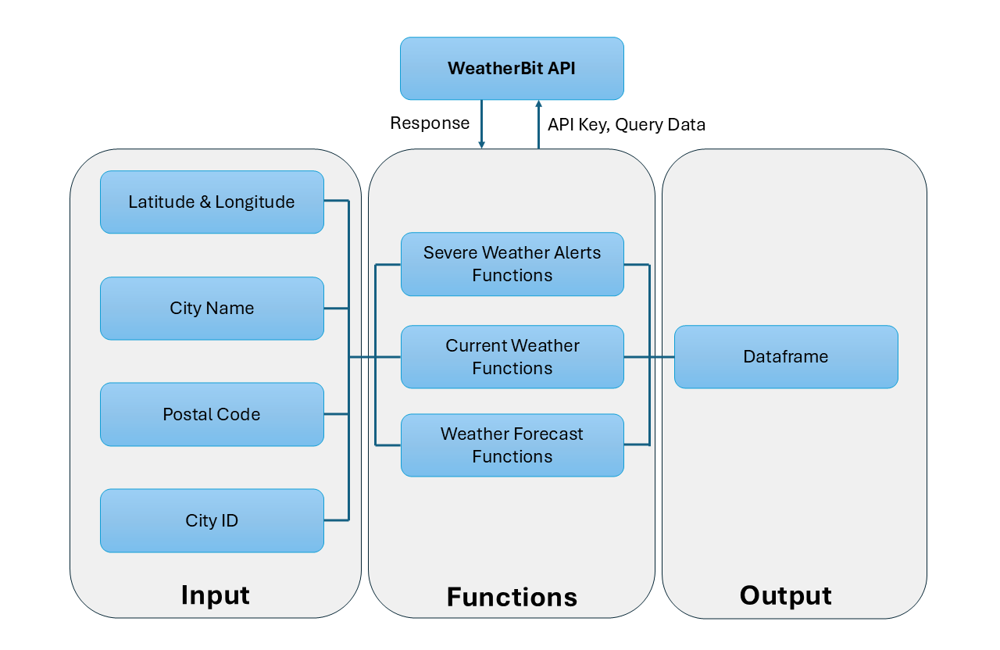

```{r, include = FALSE}
knitr::opts_chunk$set(
  collapse = TRUE,
  comment = "#>"
)
library(dplyr)
library(magrittr) 
library(jsonlite)
library(httr)
library(glue)
library(DT)
library(knitr)
library(kableExtra)
```

## **Getting Started**

Before start using `WeatherBitRWrapper`. You need to set up your Weatherbit API Key.

1.  Go to Weatherbit [API website](https://www.weatherbit.io/).
2.  Sign up and you will get your API key.

Set your API key into your `.Renviron` file.

1.  Opening the `.Renviron` file in RStudio using `file.edit("~/.Renviron")`
2.  Add `WEATHERBIT_API_KEY=your_actual_api_key_here` and saving the file.

Next, you can ready to enjoy calling `WeatherBitRWrapper` by run the following code:

```{r warning=FALSE}
# Load the package
library(WeatherBitRWrapper)
```

The following workflow diagram illustrates the overall structure of the package, detailing how user inputs are processed through various function categories to interact with the **WeatherBit API** and return structured outputs.



## Fetch Current Weather

There are 3 methods to fetch current weather data. A dataframe with key weather information will be returned.

- `get_current_temperature`: Get current temperature, feels-like temperature, and dew point.
- `get_current_wind`: Get wind speed, direction, and gusts.
- `get_current_precipitation`: Get precipitation, humidity, and cloud coverage.

**Common arguments**:

- `location`: A **string** representing the location. It can be one of:
  - A **city name** (e.g., `"Vancouver"`)
  - A **latitude/longitude pair** (e.g., `"49.28,-123.12"`)
  - A **postal code** (e.g., `"V6B1H6"`)
- `by`: A **string** specifying the location type. Choose from:
  - `"city"` for a city name.
  - `"latlon"` for latitude/longitude.
  - `"postal"` for a postal code.
- `save_dir`: (Optional) **String**. If provided, saves the result as a `.csv` file at the given directory.

### Get Current Temperature by location

```{r eval=FALSE}
get_current_temperature(location, by = "city", save_dir = "")
```

**Example**:

```{r}
# Fetch current temperature in Vancouver
df <- WeatherBitRWrapper::get_current_temperature("Vancouver")

kable(df) %>% 
  kable_styling(bootstrap_options = "striped", full_width = FALSE) %>%
  scroll_box(height = "100px")
```

### Get Current Wind by location

```{r eval=FALSE}
get_current_wind(location, by = "city", save_dir = "")
```

**Example**:

```{r}
# Fetch current wind data in Vancouver
df <- WeatherBitRWrapper::get_current_wind("Vancouver")

kable(df) %>% 
  kable_styling(bootstrap_options = "striped", full_width = FALSE) %>%
  scroll_box(height = "100px")
```

### Get Current Precipitation by location

```{r eval=FALSE}
get_current_precipitation(location, by = "city", save_dir = "")
```

**Example**:

```{r}
# Fetch current precipitation data in Vancouver
df <- WeatherBitRWrapper::get_current_precipitation("Vancouver")

kable(df) %>% 
  kable_styling(bootstrap_options = "striped", full_width = FALSE) %>%
  scroll_box(height = "100px")
```

## Fetch Alert

There are 4 methods to fetch severe weather alerts data. A dataframe with detailed alerts information will be return.

-   `weather_alert_lat`: Get alerts by latitude and longitude.
-   `weather_alert_city`: Get alerts by city name.
-   `weather_alert_postal`: Get alerts by postal code.
-   `weather_alert_id`: Get alerts by city id.

**Common arguments**:

- `save_dir`: Directory path, default at ''. To save query result as a dataframe, assign `save_dir` a valid directory path.

### Get alerts by latitude and longitude

```{r eval=FALSE}
weather_alert_lat <- (
  lat, lon, save_dir = ''
  )
```

**Example**:

```{r warning=FALSE, collapse = TRUE}
# Fetch weather alerts at [49.88307, 119.48568]

df <- WeatherBitRWrapper::weather_alert_lat(lat=49.88307, lon=119.48568)

kable(df[1:5, ]) %>% 
  kable_styling(bootstrap_options = "striped", full_width = FALSE) %>%
  scroll_box(height = "200px")
```

### Get alerts by city name

```{r eval=FALSE}
weather_alert_city <- (
  city, state = NULL, country = NULL, save_dir = ''
  )
```

**Example**:

```{r warning=FALSE, collapse = TRUE}
# Fetch weather alerts in Kelowna

df <- WeatherBitRWrapper::weather_alert_city(city="Kelowna")

kable(df[1:5, ]) %>% 
  kable_styling(bootstrap_options = "striped", full_width = FALSE) %>%
  scroll_box(height = "200px")
```

```{r warning=FALSE, collapse = TRUE}
# Fetch weather alerts in Kelowna, BC

df <- WeatherBitRWrapper::weather_alert_city(city="Kelowna", state="BC")

kable(df[1:5, ]) %>% 
  kable_styling(bootstrap_options = "striped", full_width = FALSE) %>%
  scroll_box(height = "200px")
```

```{r warning=FALSE, collapse = TRUE}
# Fetch weather alerts in Kelowna, BC, Canada

df <- WeatherBitRWrapper::weather_alert_city(city="Kelowna", state="BC", country="CA")

kable(df[1:5, ]) %>% 
  kable_styling(bootstrap_options = "striped", full_width = FALSE) %>%
  scroll_box(height = "200px")
```

### Get alerts by postal code

```{r eval=FALSE}
weather_alert_postal <- (
  postal_code, country = NULL, save_dir = ''
  )
```

**Example**:

```{r warning=FALSE, collapse = TRUE}
# Fetch weather alerts at V1V1V7

df <- WeatherBitRWrapper::weather_alert_postal(postal_code="V1V1V7")

kable(df[1:5, ]) %>% 
  kable_styling(bootstrap_options = "striped", full_width = FALSE) %>%
  scroll_box(height = "200px")
```

```{r warning=FALSE, collapse = TRUE}
# Fetch weather alerts at V1V1V7, Canada

df <- WeatherBitRWrapper::weather_alert_postal(postal_code="V1V1V7", country="CA")

kable(df[1:5, ]) %>% 
  kable_styling(bootstrap_options = "striped", full_width = FALSE) %>%
  scroll_box(height = "200px")
```

### Get alerts by city id

```{r eval=FALSE}
weather_alert_id <- (
  city_id, save_dir = ''
  )
```

**Example**:

```{r warning=FALSE, collapse = TRUE}
# Fetch weather alerts at 8953360

df <- WeatherBitRWrapper::weather_alert_id(city_id=8953360)

kable(df[1:5, ]) %>% 
  kable_styling(bootstrap_options = "striped", full_width = FALSE) %>%
  scroll_box(height = "200px")
```


## Fetch Forecast Weather

There are 4 methods to fetch forecast weather data. A dataframe with forecast data will be return.

-   `get_forecast_by_city`: Get forecast weather by city name.
-   `get_forecast_by_lat_lon`: Get forecast weather by latitude and longitude. (Recommended)
-   `get_forecast_by_postal_code`: Get forecast weather by postal.
-   `get_forecast_by_city_id`: Get forecast by city id.

**Common arguments**:

- `save_dir`: Directory path, default at ''. To save query result as a dataframe, assign `save_dir` a valid directory path.
- `language`: Weatherbit API supports a list of language as return. `English` is the default language.Other available options:
  Available language list:
    - `en` - [DEFAULT] English
    - `ar` - Arabic
    - `az` - Azerbaijani
    - `be` - Belarusian
    - `bg` - Bulgarian
    - `bs` - Bosnian
    - `ca` - Catalan
    - `cz` - Czech
    - `da` - Danish
    - `de` - German
    - `fi` - Finnish
    - `fr` - French
    - `el` - Greek
    - `es` - Spanish
    - `et` - Estonian
    - `ja` - Japanese
    - `hr` - Croation
    - `hu` - Hungarian
    - `id` - Indonesian
    - `it` - Italian
    - `is` - Icelandic
    - `iw` - Hebrew
    - `kw` - Cornish
    - `lt` - Lithuanian
    - `nb` - Norwegian Bokmål
    - `nl` - Dutch
    - `pl` - Polish
    - `pt` - Portuguese
    - `ro` - Romanian
    - `ru` - Russian
    - `sk` - Slovak
    - `sl` - Slovenian
    - `sr` - Serbian
    - `sv` - Swedish
    - `tr` - Turkish
    - `uk` - Ukrainian
    - `zh` - Chinese (Simplified)
    - `zh`-tw - Chinese (Traditional)
- `unit`: Unit used in weather results. Default as `Metric (Celsius, m/s, mm)`. Other options:
  - `M` - [DEFAULT] Metric (Celsius, m/s, mm)
  - `S` - Scientific (Kelvin, m/s, mm)
  - `I` - Fahrenheit (F, mph, in).
- `day`: A specific number of forecast days. Default as 16. The max number is 16.

### Get forecast weather by city name

```{r eval=FALSE}
get_forecast_by_city <- (
  city, save_dir = '', language = 'en', unit = 'M', day = 16
  )
```

**Example**:

```{r warning=FALSE, collapse = TRUE}
# Fetch next 16 days weather in Raleigh, NC.

df <- WeatherBitRWrapper::get_forecast_by_city("Raleigh,NC")

kable(df[1:16, ]) %>% 
  kable_styling(bootstrap_options = "striped", full_width = FALSE) %>%
  scroll_box(height = "300px")
```

Example to draw a temperature line chart
```{r, warning=FALSE, , fig.width=6, fig.height=4}
library(ggplot2)

# Fetch forecast data in Raleigh,NC
weather_data <- WeatherBitRWrapper::get_forecast_by_city("Raleigh,NC", save_dir = './')

# Convert date format.
weather_data$data.datetime <- as.Date(weather_data$data.datetime)

# Create an area chart
ggplot(weather_data, aes(x = data.datetime)) +
  geom_ribbon(aes(ymin = data.app_min_temp, ymax = data.app_max_temp), fill = "skyblue", alpha = 0.5) +
  geom_line(aes(y = data.app_max_temp), color = "red", linewidth = 1) +   # High temp line
  geom_line(aes(y = data.app_min_temp), color = "blue", linewidth = 1) +   # Low temp line
  labs(title = "Raleigh,NC - Daily Temperature Range",
       x = "Date",
       y = "Temperature (°C)")
```


```{r warning=FALSE}
# Fetch next 16 days weather in Raleigh, NC in Chinese.

df <- WeatherBitRWrapper::get_forecast_by_city("Raleigh,NC", language = "fr")

kable(df[1:16, ]) %>% 
  kable_styling(bootstrap_options = "striped", full_width = FALSE) %>%
  scroll_box(height = "300px")
```

```{r warning=FALSE}
# Fetch next 16 days weather in Raleigh, NC with Fahrenheit.

df <- WeatherBitRWrapper::get_forecast_by_city("Raleigh,NC", unit = 'I')

kable(df[1:16, ]) %>% 
  kable_styling(bootstrap_options = "striped", full_width = FALSE) %>%
  scroll_box(height = "300px")
```


### Get forecast weather by latitude and longitude

```{r eval=FALSE}
get_forecast_by_lat_lon <- (
  lat, lon, save_dir = '', language = 'en', unit = 'M', day = 16
)
```

**Example**:

```{r warning=FALSE}
# Fetch next 16 days weather in [38.123, 78.543].

df <- WeatherBitRWrapper::get_forecast_by_lat_lon(lat=38.123, lon=-78.543)

kable(df[1:16, ]) %>% 
  kable_styling(bootstrap_options = "striped", full_width = FALSE) %>%
  scroll_box(height = "300px")
```

### Get forecast weather by postal code

```{r eval=FALSE}
get_forecast_by_postal_code(
  postal_code,  country, save_dir = "", language = "en", unit = "M", day = 16
  )
```

**Example**:

```{r warning=FALSE}
# Fetch next 16 days weather at 22202.

df <- WeatherBitRWrapper::get_forecast_by_postal_code(postal_code=22202, country='US')

kable(df[1:16, ]) %>% 
  kable_styling(bootstrap_options = "striped", full_width = FALSE) %>%
  scroll_box(height = "300px")
```

### Get forecast weather by city id

```{r eval=FALSE}
get_forecast_by_city_id (
  city_id, save_dir = '', language = 'en', unit = 'M', day = 16
  )
```

**Example**:

```{r warning=FALSE}
# Fetch next 16 days weather at 8953360

df <- WeatherBitRWrapper::get_forecast_by_city_id(city_id = 8953360)

kable(df[1:16, ]) %>% 
  kable_styling(bootstrap_options = "striped", full_width = FALSE) %>%
  scroll_box(height = "300px")
```

## Reference
### City ID, Postal Codes, Contriy Names
To check full list of city ID, postal codes, and country names, please check the [Weatherbit link](https://www.weatherbit.io/api/meta?ref=help.weatherbit.io)

